### Hi there 👋

- 🔭 I’m currently researching Deep Reinforcement Learning and Operations Research for Combinatorial Optimization.
- 🌱 I’m currently learning about Pixel Art for Game Development and programming Mobile and Web based Applications.
- 👯 I’m looking to collaborate on any optimization related research or coding project.
- 🤔 I’m looking for help with Art and Design.
- 💬 Ask me about subjects related to Computer Science and Engineering.
- 📫 How to reach me: afonso.fernandes100@gmail.com
- ⚡ Fun fact: the Hydra's stem cells, which give it vast regenerative capabilities, make it potentially immortal.

### My GitHub Statistics

