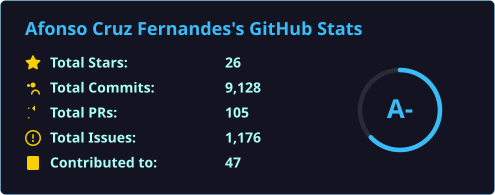
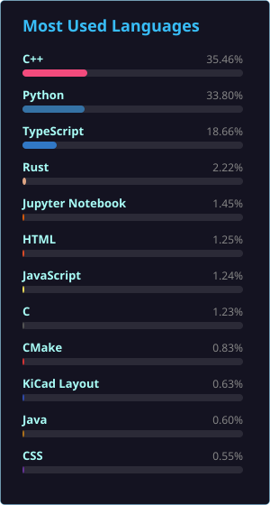

  

  
  
  
  
  

 

### 🔬 About Me

- 🔭 **Research**: Deep Reinforcement Learning & Operations Research for Combinatorial Optimization.
- 🌱 **Learning**: Pixel Art for Game Development, plus Mobile & Web Application Engineering.
- 👯 **Collaborations**: Open to collaborate on optimization research, AI, and game development projects.
- 🤔 **Looking for help**: Game Art & Visual Design.
- 💬 **Ask me about**: Computer Science, AI, Reinforcement Learning, and Operations Research.
- ⚡ **Fun fact**: The Hydra's stem cells, which give it vast regenerative capabilities, make it biologically immortal!

 

### 🛠️ Tech Stack & Skills

  
  
  
  
  
  
   
  
  
  
  
  
  
  

 

### 📊 GitHub Statistics

  
    
  
    
  

