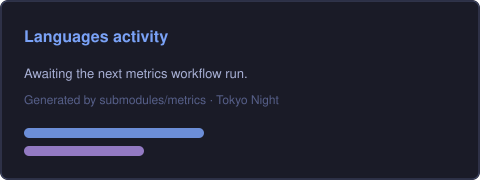
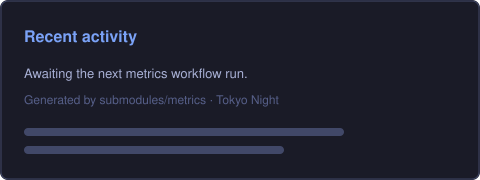

  

   

  

    

  <!-- Social badges from submodules/markdown-badges -->
  
  
  
  
  
  

    

  
  
  
  
  
  

 

---

### 🔬 About Me & Research Focus

<table>
  <tr>
    <td width="50%" valign="top">

#### 🎯 What Drives Me
- 🔭 **Research**: Deep Reinforcement Learning (RL) & Operations Research (OR) aimed at solving complex NP-hard Combinatorial Optimization problems (TSP, VRP, Scheduling).
- 🧠 **Methodologies**: Hybrid algorithms uniting Graph Neural Networks (GNNs) with classical heuristics & metaheuristics.
- 🌱 **Learning**: Art & Animation for Game Development, plus Mobile & Web Application Engineering.
- ⚡ **Fun Fact**: Hydra stem cells grant them perpetual regenerative capabilities, making them biologically immortal!

</td>
<td width="50%" valign="top">

#### 🤝 Collaboration & Inquiries
- 👯 **Open to Collaborate**: Research initiatives on combinatorial solvers, scientific RL baselines, and indie game systems.
- 🤔 **Looking for Help**: Art, Animation, and Visual Design.
- 💬 **Ask Me About**: Computer Science & Engineering, Mathematics, Artificial Intelligence, and Operations Research.
- 📬 **Reach Out**: Drop an email or message anytime via [LinkedIn](https://linkedin.com/in/afonso-cruz-fernandes-31a38612a) or [X](https://twitter.com/PeacekeeperBH).

</td>
</tr>
</table>

 

---

### 🛠️ Tech Stack & Skills

Badges sourced from [`submodules/markdown-badges`](https://github.com/ACFHarbinger/markdown-badges).

#### 💻 Programming Languages

#### 🧠 Machine Learning, Optimization & Scientific Computing

#### 🎮 Game Development, 2D Art & Animation

#### 🌐 Web Engineering & Databases

#### ⚙️ Developer Tools, Systems & DevOps

 

---

### 🚀 Featured Research & Projects

<table>
  <tr>
    <td width="50%" valign="top">
      <h4>📦 <a href="https://github.com/ACFHarbinger/WSmartPlus-Route">WSmartPlus-Route</a></h4>
      
Machine Learning models and Operations Research solvers for Combinatorial Optimization problems, focusing on vehicle route planning for smart logistics and waste collection.

      

        
        
        
      

    </td>
    <td width="50%" valign="top">
      <h4>🤖 <a href="https://github.com/ACFHarbinger/nglab">nglab</a></h4>
      
<i>Nothing Gambles Like A Bot (NGLAB)</i> — A Multimodal Deep Reinforcement Learning bot designed to assist in complex sequential decision-making and market modeling.

      

        
        
      

    </td>
  </tr>
  <tr>
    <td width="50%" valign="top">
      <h4>👥 <a href="https://github.com/ACFHarbinger/Coding-Assistants">Coding-Assistants</a></h4>
      
An orchestration environment built in Rust where multiple LLM agents collaborate, discuss, and implement solutions across a given target codebase.

      

        
        
      

    </td>
    <td width="50%" valign="top">
      <h4>🎨 <a href="https://github.com/ACFHarbinger/Cel-Shaded-Generator">Cel-Shaded-Generator</a></h4>
      
Semi-autonomous cel-shaded visual generator leveraging Machine Learning and numerical optimization to assist human digital art development.

      

        
        
        
      

    </td>
  </tr>
</table>

 

---

### 🏆 GitHub Achievements & Trophies

  

 

---

### 📊 Live GitHub Analytics & Telemetry

Cards in this section are generated twice daily by [`.github/workflows/github-stats.yaml`](./.github/workflows/github-stats.yaml) using the local [`submodules/metrics`](https://github.com/ACFHarbinger/metrics) action.

<table>
  <tr>
    <td width="50%" valign="top" align="center">
      
    </td>
    <td width="50%" valign="top" align="center">
      
       
      
    </td>
  </tr>
  <tr>
    <td width="50%" valign="top" align="center">
      
    </td>
    <td width="50%" valign="top" align="center">
      
    </td>
  </tr>
</table>

 

 

<picture>
  <source media="(prefers-color-scheme: dark)" srcset="./profile/github-snake-dark.svg">
  <source media="(prefers-color-scheme: light)" srcset="./profile/github-snake.svg">
  
</picture>

 

---

### 🌟 Open Source & Submodule Integrations

This profile is assembled from two vendored submodules plus a scheduled GitHub Actions pipeline:

| Submodule | Role |
| :--- | :--- |
| 📦 [`submodules/metrics`](https://github.com/ACFHarbinger/metrics) | Infocards, isometric calendar, languages, activity, and achievements — rendered into `profile/*.svg` twice a day |
| 🎨 [`submodules/markdown-badges`](https://github.com/ACFHarbinger/markdown-badges) | Curated Shields.io / Simple Icons badge catalog used throughout this README |

Refresh is automatic (`00:00` and `12:00` UTC, plus manual `workflow_dispatch`). A personal access token in `METRICS_TOKEN` (or `PAT_TOKEN` / `GH_PAT`) is recommended so GraphQL plugins stay within rate limits; `GITHUB_TOKEN` is the fallback.

---

  

  <i>"The only way to do great work is to love what you do." — Stay curious and keep optimizing.</i>

